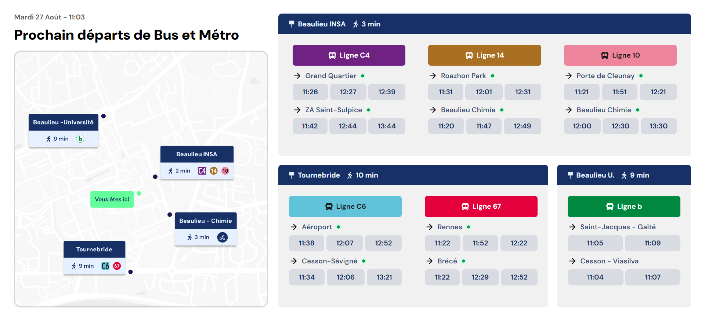

# Project Name



## Description

This project is a React application designed to be displayed on the hall TV of the Ecole Supérieure d'Ingénieurs de Rennes. The application provides real-time information on bus and metro schedules for stops close to the school from the STAR public transport API, processes it, and displays upcoming departures and other relevant information for different stops and lines.. It aims to keep students informed about the upcoming departures and enhance their commuting experience.

## Features

- **Data Fetching**: Retrieves real-time bus and metro schedules from STAR's API.
- **Component-based Architecture**: Utilizes reusable React components for different parts of the UI.
- **Error Handling**: Includes error handling for API requests and data processing.

## Getting Started

To get this project up and running locally, follow these steps:

### Prerequisites

- Node.js (v14 or later)
- npm or yarn

### Installation

1. **Clone the repository:**

    ```bash
    git clone https://github.com/wajrock/campus-departures.git
    cd your-repository
    ```

2. **Install dependencies:**

    ```bash
    npm install
    # or
    yarn install
    ```

3. **Start the development server:**

    ```bash
    npm start
    # or
    yarn start
    ```

    This will start the development server and open the application in your default web browser.

### Project Structure

- **`src`**: Contains the main application code.
  - **`components`**: React components used in the application.
  - **`utils`**: Utility functions and context providers.
  - **`App.tsx`**: Main application component.
  - **`index.tsx`**: Entry point of the application.
- **`public`**: Contains static assets like the `index.html` file.
- **`styles`**: CSS or SCSS files for styling the application.

### API Endpoints

The application fetches data from the following endpoints:

- **Bus Data:**
  - `https://data.explore.star.fr/api/explore/v2.1/catalog/datasets/tco-bus-circulation-passages-tr/records`
  
- **Metro Data:**
  - `https://data.explore.star.fr/api/explore/v2.1/catalog/datasets/tco-metro-circulation-deux-prochains-passages-tr/records`

### Environment Variables

No environment variables are required for this project, but you may need to configure any environment-specific settings if deploying to a production environment.

### Error Handling

Errors during data fetching are handled and logged to the console. Ensure to check the browser console for any error messages if the application is not functioning as expected.

### Contributing

Contributions are welcome! Please follow these guidelines:

1. Fork the repository.
2. Create a new branch for your feature or fix.
3. Commit your changes.
4. Open a pull request with a clear description of your changes.

### License

This project is licensed under the MIT License. See the [LICENSE](LICENSE) file for details.

### Contact

For questions or feedback, please reach out to [thibaud.wajrock@outlook.com](mailto:thibaud.wajrock@outlook.com).

---

Happy coding!
